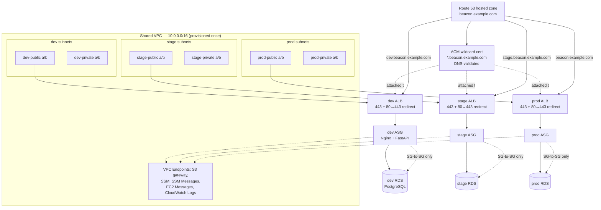

# Cloud & DevOps Design: Beacon — Phase B

**Author:** M.L.
**Status:** v3 — implemented and live in **dev** (see §0); stage and prod designed but not provisioned. Decisions in §10.
**Depends on:** `3T-APP-DESIGN.md` (application design, Phase A). This document assumes Phase A is complete: the app runs correctly on localhost, satisfies its Operational Contract (§11 of `3T-APP-DESIGN.md`), and its CI-readiness requirements (§13.1) are met.
**Scope:** Branch strategy, pipeline/workflow strategy, environment strategy, and infrastructure strategy for deploying Beacon to AWS on EC2. Excludes Kubernetes/EKS, ECS/Fargate, container registries, and multi-region — those are explicitly out of scope for this phase. (The backend does run as a single Docker container per instance; §6.4.)

---

## 0. Implementation Status (2026-09-24)

**Scope decision:** everything runs in **dev** only. Stage and prod have their GitHub Environments, deploy roles, branch protection, and code paths (`environments/*.tfvars` is the only piece missing), but **no infrastructure is provisioned for them**, by choice, to limit cost. Every mechanism below has been exercised end to end in dev. Operating procedures are in [`RUNBOOK.md`](RUNBOOK.md).

| Area | State |
|---|---|
| Bootstrap (§5.2) | ✅ State and releases buckets, OIDC deploy roles (dev/stage/prod/shared), instance permissions boundary |
| Network (§6.2) | ✅ Shared VPC, 14 subnets, IGW, no NAT, S3 gateway + 4 interface endpoints |
| Base AMI (§6.4) | ✅ Packer-built AL2023 + Docker, Nginx, CloudWatch Agent; published to `/loria-beacon/base-ami-id`; newest 3 kept |
| dev infrastructure (§6) | ✅ ALB (HTTP), ASG, RDS PostgreSQL 16, SSM parameters, log groups |
| Deploy (§7.1) | ✅ Test → build/publish → migrate (migrator + SSM) → rolling refresh → curl + browser smoke tests → notify |
| Rollback (§7.2) | ✅ By default, SHA, or version; published/proven/schema rules; dry run; drilled with zero downtime |
| CI | ✅ `test.yml` on every push to `dev` (stub) and in every deploy; `ci.yml` lints workflows on PRs into `main` |
| Notifications (§4.5) | ✅ GitHub-only: failure issue per environment, auto-closed on recovery |
| Dev seed data | ✅ `seed.yml` (dev only) |
| Stage / prod | ⏸ Not provisioned (scope decision). The PR-trigger stub and validate mode (§3.4) aren't built, since they need stage infra to run |
| DNS / HTTPS (§6.7) | ⏸ Deferred until a domain exists |

## 1. Summary

Beacon deploys to AWS on **EC2 (not containers, not Fargate, not EKS)** across three environments — dev, stage, prod — sharing one VPC and one base AMI, with environment-specific application infrastructure (ALB, security groups, Auto Scaling Group, RDS for PostgreSQL) isolated at the security-group level. Each environment is reachable over **HTTPS**, via a Route 53-hosted domain and a wildcard ACM certificate shared across all three ALBs (deferred until a domain is registered; HTTP on the ALB DNS name until then, §6.7). Infrastructure lifecycle (stand up / tear down) and application promotion (dev → stage → prod) are treated as two independent concerns with separate tooling and separate triggers.

## 2. Guiding Principles

These principles resolve most detailed decisions below; when a new decision arises during implementation that this document doesn't cover, resolve it against these first.

1. **Build once, promote forward.** One artifact (app release tarball) or one base image (AMI) is created once and promoted through environments unchanged. Never rebuild per environment.
2. **Infrastructure lifecycle and app promotion are independent axes.** Standing up or tearing down an environment's infrastructure is a cost/availability decision. Promoting a code change from dev to stage to prod is a release decision. Nothing about this design couples the two, though app promotion has infrastructure as a precondition (§7.1.1).
3. **No long-lived credentials anywhere.** GitHub Actions assumes AWS IAM roles via OIDC. No access keys are stored as GitHub secrets.
4. **Least privilege, scoped by environment.** A pipeline run targeting dev cannot touch stage or prod resources, enforced by IAM policy, not by convention.
5. **Every gate is either a PR review, a required-reviewer approval, or both — never neither, for stage and prod.**
6. **State and secrets are never in Git.** Terraform state lives in S3, locked via S3-native lockfiles (`use_lockfile = true`; DynamoDB locking is deprecated in Terraform ≥ 1.11). Runtime secrets live in SSM Parameter Store (SecureString) or Secrets Manager, fetched at boot or deploy time.
7. **Fail loud, fail fast, fail early.** Prefer a clear pipeline error over a resource silently misconfigured. Add preflight checks (§7.1.1) rather than let failures surface deep inside an AWS API call.

## 3. Branch Strategy

### 3.1 Branches and what they hold

| Branch | Holds | Protection |
|---|---|---|
| `main` | **Only** `.github/workflows/*.yml` (all pipeline logic). Never holds application code, Terraform code, or environment config. | Protected: PR required, no direct push. This is where pipeline logic itself is reviewed and changed. |
| `dev` | Application code, Terraform code, environment config (`infra/env/environments/*.tfvars`), and the PR-trigger stubs (§3.4). Active development branch. | Unprotected. Direct pushes and merges allowed; this is the working branch. |
| `stage` | Promoted, PR-reviewed application and Terraform code, config for the stage environment. | Protected: PR required from `dev`, no direct push. |
| `prod` | Promoted, PR-reviewed application and Terraform code, config for the prod environment. | Protected: PR required from `stage`, no direct push. |

**`main` is deliberately outside the application promotion chain.** It never receives a PR from `dev`, `stage`, or `prod`, and they never receive a PR from it. It exists solely to host workflow definitions, because GitHub Actions requires workflow files to physically exist on a branch to be listed and manually dispatched from that branch's Actions view — keeping them in one place, reviewed independently of app changes, avoids workflow-definition drift across four branches.

### 3.2 Promotion flow

```
feature work → dev (direct push, no gate)
dev → PR → stage (protected: review required, triggers validation on push, deploy on merge)
stage → PR → prod (protected: review required, triggers validation on push, deploy on merge)
```

Workflow files are edited via PR into `main` independently of this flow. A workflow change does not need to pass through `dev`/`stage`/`prod` to take effect, since GitHub always runs the copy of the workflow that exists on the branch the run is dispatched *from* — in this design, that's always `main`.

### 3.3 Why this shape, and its trade-off

Separating `main` from the app-promotion branches means pipeline logic can be iterated on independently of app release cadence, and it eliminates workflow-file drift (there's exactly one copy of each `.yml`, ever). The trade-off: every workflow run must specify which branch's *content* to check out via an explicit `ref` input, since push events to `dev`/`stage`/`prod` trigger nothing (no workflow files live there to receive them). This is a deliberate choice, not an oversight — see §4.1.

### 3.4 Exception: PR-trigger stubs

GitHub runs a `pull_request` workflow from the files in the PR's merge ref (head + base), never from the default branch. A workflow that exists only on `main` therefore **cannot** fire on a PR into `stage` or `prod`. To keep PR-triggered deploys (§3.2) without duplicating pipeline logic, one thin stub lives outside `main`:

```yaml
# .github/workflows/promote.yml — on dev, promoted to stage/prod with everything else
on:
  pull_request:
    branches: [stage, prod]
    types: [opened, synchronize, reopened, closed]
jobs:
  promote:
    uses: loriamichaelj/beacon/.github/workflows/deploy.yml@main
    with:
      environment: ${{ github.base_ref }}
      mode: ${{ github.event.pull_request.merged && 'deploy' || 'validate' }}
```

The stub contains no logic — only the trigger and a call into the reusable `deploy.yml` on `main`. It is committed on `dev` and reaches `stage`/`prod` through normal promotion; its `branches:` filter makes it inert on PRs targeting anything else. Pipeline logic still has exactly one copy, on `main`.

## 4. Pipeline / Workflow Strategy

### 4.1 The trigger mechanism, explained once

Every workflow lives only on `main` and is invoked one of two ways:

- **`workflow_dispatch`** — manually triggered from the GitHub Actions dashboard ("Run workflow" button), or via `gh workflow run` / the REST API. Takes explicit inputs, including `ref` (which branch's content to check out) and `environment` (which target environment's config and IAM role to use). These are two different concepts that happen to share a name in this project — `ref` picks *files*, `environment` picks *GitHub Environment protection rules and secrets* — and both must be set correctly.
- **`pull_request`**, filtered by target branch and merge status — automatically triggered by PR activity against `stage` or `prod`, via the stub in §3.4 calling the reusable workflow on `main`. Every push to such a PR runs a **validate** job (plan/lint/test/scan, no mutation). Only the PR's **merge** (`github.event.pull_request.merged == true`) runs the **apply/deploy** job, which is additionally gated by a GitHub Environment required-reviewer rule.

This means "PR-triggered" and "environment-gated" are two independent, stacked controls on stage/prod deploys: the PR merge is what *starts* the job, and the Environment protection rule is what *pauses* it before it actually mutates anything, requiring a second, explicit approval click. Nothing on stage or prod happens from a single action by a single person.

### 4.2 Workflow inventory

| File | Purpose | Trigger | Environments |
|---|---|---|---|
| `bootstrap.yml` | Creates the state bucket if missing, then plans/applies `infra/bootstrap/`: releases bucket, the four deploy roles, the instance permissions boundary. | `workflow_dispatch` | `bootstrap` Environment (manually created `beacon-bootstrap` role, §5.2) |
| `terraform.yml` | Plan / apply / destroy for the Terraform roots: the shared network (`target=network`), shared DNS (`target=dns`), and per-environment application infrastructure (`target=infra`). | `workflow_dispatch` | `network`/`dns`: `shared` Environment. `infra`: dev, stage, prod via `environment` input |
| `ami.yml` | Packer build of the shared base AMI (OS hardening, Docker Engine, Nginx, CloudWatch Agent). Publishes the resulting AMI ID to SSM Parameter Store. | `workflow_dispatch` | `shared` Environment |
| `deploy.yml` | Reusable. `dev`: build, test, package, upload to S3. All envs: migrate, update the release-version SSM parameter, instance refresh, smoke test, notify. `validate` mode: lint/test/plan only. | `workflow_dispatch` (dev) and `workflow_call` (from the §3.4 stub, for stage and prod) | dev, stage, prod |
| `rollback.yml` | Revert an environment's release-version SSM parameter to a prior version; trigger an instance refresh; smoke test. | `workflow_dispatch` | dev, stage, prod |
| `ci.yml` | actionlint (with shellcheck) on PRs into `main`; its **Lint workflows** check is required by `main`'s protection. `main` holds only workflows, so there's no app code to test there. | `pull_request` → `main`, `workflow_dispatch` | none |
| `test.yml` | Reusable app lint + tests (`make lint`, `make test`): the one definition of green, called by `deploy.yml` and by the `dev-ci.yml` stub. | `workflow_call`, `workflow_dispatch` | none |
| `seed.yml` | Loads the local-dev seed data into **dev** from the running release, via SSM on a healthy instance. Idempotent; has no environment input. | `workflow_dispatch` | dev |
| `dev-ci.yml` *(stub, on `dev`)* | Calls `test.yml@main` on every push to `dev` (same stub pattern as §3.4). | `push` → `dev` | none |

Eight files on `main`, plus trigger stubs on the app branches (§3.4) — all satisfying the Operational Contract's CI-readiness expectations from `3T-APP-DESIGN.md` §13.1 (no dependency on anything beyond stock GitHub-hosted runners and OIDC-assumed AWS credentials).

### 4.3 Why `rollback.yml` is manual-dispatch, not PR-triggered

Every other stage/prod-affecting workflow in this design is PR-triggered, which is intentional friction — code review before code ships. Rollback is the deliberate exception: **during an incident, the friction of authoring and waiting on a PR is a cost, not a safety benefit.** `rollback.yml` is `workflow_dispatch`-only, but still gated by the same GitHub Environment required-reviewer rule on stage/prod, preserving the "two humans in the loop for prod" property without adding a PR review cycle to the critical path of restoring service.

### 4.4 `terraform.yml` structure

One workflow, two Terraform roots, three actions:

```yaml
on:
  workflow_dispatch:
    inputs:
      action:
        type: choice
        options: [plan, apply, destroy]
      target:
        type: choice
        options: [network, dns, infra]
      environment:
        type: choice
        options: [dev, stage, prod]
        description: "Ignored when target=network or target=dns"
```

- `target=network`: applies once against `env:/shared/network.tfstate`. The `environment` input is accepted for form consistency but unused — network resources aren't environment-scoped.
- `target=dns`: applies once against `env:/shared/dns.tfstate`. Creates the Route 53 hosted zone (if not already delegated), the wildcard ACM certificate, and its DNS validation record. Shared across all three environments; `environment` input unused. Depends on `target=network` having been applied first only insofar as certificate validation has no VPC dependency — in practice these two are independent and can be applied in either order.
- `target=infra`: applies the `infra/env/` root against `env:/${environment}/infra.tfstate`, using `infra/env/environments/${environment}.tfvars`, reading the shared network's subnet/VPC outputs and the shared DNS module's certificate ARN via `terraform_remote_state` data sources.

A safety check runs before any `apply`/`destroy`: verify the resolved backend `key` matches the requested `environment`/`target` combination, and fail the job rather than proceed if they don't line up. This catches the single most likely operator error in this design — a workflow-wiring bug or a misclick that applies the wrong `tfvars` against the wrong state key.

### 4.5 Notifications

**GitHub-only** (decided 2026-09-24). A composite action, `.github/actions/pipeline-status`, runs at the end of every deploy and every real (non-dry-run) rollback:

- **Failure:** opens the issue `[<env>] pipeline failure` (label `pipeline-failure`), assigned to whoever ran the pipeline so GitHub notifies them. If that issue is already open, it comments on it instead. In deploys, a failed test or build job counts too, not just the rollout.
- **Success:** if that issue is open, comments **Recovered** with the run link and closes it.
- **Cancelled / skipped:** nothing.

Dry-run rollbacks never notify: a rule rejecting a target there is the check working. GitHub's per-Environment deployment history records every run as well. This meets the minimum bar: a failed deploy or smoke test is visible outside the Actions tab. Slack or SNS can be added later without changing the workflows' structure.

## 5. Environment Strategy

### 5.1 What "environment" means in this design

Three GitHub Environments (`dev`, `stage`, `prod`, configured under repo Settings → Environments) provide the items below. A fourth Environment, `shared`, exists only to scope the credentials for account-wide work (network, DNS, AMI builds); it is not an application environment and has no deploy target.
- **Environment-scoped secrets** — each environment's AWS IAM role ARN (for OIDC assumption), stored as an environment secret rather than a repo-wide one, so a workflow run targeting dev cannot accidentally read prod's role ARN.
- **Required reviewers** — configured on `stage` and `prod` only. `dev` has none.
- **Deployment history** — every job run against a GitHub Environment is recorded with who approved it and when, satisfying the "maintain deployment history" requirement.

| Environment | Required reviewers | Wait timer | Branch restriction |
|---|---|---|---|
| `dev` | None | None | None (any ref) |
| `stage` | Yes — at least one reviewer, ideally distinct from the PR approver | None | None (dispatch target is always `stage` branch content in practice) |
| `prod` | Yes — required reviewer, distinct group/person from stage's reviewer where possible | Optional; consider a short wait timer as an additional deliberate pause | None |
| `shared` | Yes — changes to network/DNS/AMI affect every environment | None | None |

### 5.2 Bootstrap and IAM roles

**All AWS access runs through GitHub Actions**; nothing is applied from a laptop. A workflow can't grant itself AWS access, so exactly two things are created by hand, once, in the AWS Console: the GitHub OIDC identity provider, and a `beacon-bootstrap` role. That role trusts only the `bootstrap` GitHub Environment (required reviewer, `main` only), and it can manage only `beacon-deploy-*` roles and policies and the two Beacon buckets. It can't modify itself. The exact policies and steps are in `infra/bootstrap/README.md`.

`bootstrap.yml` then assumes `beacon-bootstrap` and applies `infra/bootstrap/`:

- The Terraform state bucket `beacon-tfstate-<account-id>` (versioned, SSE, public access blocked, TLS-only). The workflow creates it with the AWS CLI before `terraform init`, since Terraform can't create the bucket its own state lives in. `infra/bootstrap/` then imports it, and its own state lives in it at `env:/shared/bootstrap.tfstate`.
- The release artifact bucket `beacon-releases-<account-id>` (versioned, SSE, public access blocked). S3 bucket names are global, hence the account suffix.
- The GitHub OIDC identity provider.
- Four deploy roles:
  - `beacon-deploy-dev`
  - `beacon-deploy-stage`
  - `beacon-deploy-prod`
  - `beacon-deploy-shared` — network, DNS, and AMI; the only role that can touch the VPC, endpoints, hosted zone, or `/beacon/base-ami-id`

Each role's trust policy requires `sub = repo:loriamichaelj@165821667/beacon@1382087094:environment:<env>`, the OIDC subject GitHub issues when a job declares `environment: <env>`. The repo uses GitHub's **immutable subject** format (`owner@owner-id/repo@repo-id`), so a repository deleted and recreated under the same name gets new IDs and cannot assume these roles. The prefix is set in `infra/project.env` (`GITHUB_OIDC_SUB_PREFIX`). A job can only obtain the role for the Environment it is running in, and stage/prod/shared jobs only get that far after the Environment's required-reviewer approval.

Each role's IAM policy is scoped by resource tag/naming convention (`beacon-${environment}-*`) rather than being a blanket account-wide policy — this is what makes "same AWS account, three environments" actually safe. A workflow run that assumed the dev role cannot mutate any resource tagged for stage or prod, even if the workflow logic had a bug that tried to.

**Caveat:** resource-level scoping is uneven across AWS services. Some create/describe actions (e.g., many `ec2:Describe*`, `ec2:CreateSecurityGroup` in a shared VPC, `elasticloadbalancing:Describe*`) either don't support resource ARNs or only support tag conditions (`aws:RequestTag`, `aws:ResourceTag`). Policies scope by ARN name pattern where supported, by tag condition where that's the only option, and allow `*` only for read-only `Describe*`/`List*` actions. Each remaining unscoped action is listed with a comment in the policy source.

### 5.3 Resource naming convention

**The AWS account is shared with other projects**, so every name carries a project prefix, set once in `infra/project.env`:

| Prefix | Value | Used for |
|---|---|---|
| `NAME_PREFIX` | `loria-beacon` | S3 buckets, ALB/target group/ASG/RDS names, SSM parameter paths, log groups, the `Project` tag |
| `IAM_NAME_PREFIX` | `cloudbatch818-loria-beacon` | IAM roles, policies, instance profiles (the account requires IAM role names to start with `cloudbatch818-`) |

There are two prefixes because ALB and target group names are limited to 32 characters. `cloudbatch818-loria-beacon-prod-alb` would be 35.

Every resource created by Terraform includes the environment in its name and as a tag:
```
loria-beacon-${environment}-alb
loria-beacon-${environment}-asg
loria-beacon-${environment}-rds
cloudbatch818-loria-beacon-${environment}-instance     (IAM role + instance profile)
/loria-beacon/${environment}/release-version           (SSM)
```
Tags applied to every resource: `Environment=${environment}`, `Project=loria-beacon`, `ManagedBy=terraform`. IAM policy scoping (§5.2) relies on this convention, and it prevents name collisions between environments and with other projects in the account. Every tag-based IAM condition checks **both** `Environment` and `Project`; another project's `Environment=dev` resources must not be reachable by this project's dev role.

**Shorthand in this document:** the sections below still write `beacon-…` names, `/beacon/…` paths, and role names like `beacon-deploy-dev` for readability. Read `beacon-` as `loria-beacon-` for resource names and paths, and as `cloudbatch818-loria-beacon-` for IAM names.

## 6. Infrastructure Strategy

### 6.1 High-level architecture



### 6.2 Network design

One VPC (`10.0.0.0/16`) shared across all three environments, created once by `terraform.yml -target=network`. Rationale: interface VPC endpoints (SSM, SSM Messages, EC2 Messages, CloudWatch Logs) are billed per-AZ, per-VPC; sharing one VPC means paying for one set (~$58/mo: 4 interface endpoints × 2 AZs × ~$7.30) instead of three. This is a deliberate cost/isolation trade-off — see §6.6.

Subnet allocation, two AZs per environment (ALB requires ≥2 AZs):

| Environment | Public (ALB) | Private (EC2, RDS) |
|---|---|---|
| dev | `10.0.0.0/24`, `10.0.1.0/24` | `10.0.10.0/24`, `10.0.11.0/24` |
| stage | `10.0.2.0/24`, `10.0.3.0/24` | `10.0.12.0/24`, `10.0.13.0/24` |
| prod | `10.0.4.0/24`, `10.0.5.0/24` | `10.0.14.0/24`, `10.0.15.0/24` |
| shared (endpoints) | — | `10.0.20.0/24`, `10.0.21.0/24` |

The interface endpoints' network interfaces live in the dedicated shared subnets so no environment's subnets host infrastructure the other environments depend on. Endpoints have their own security group allowing TCP 443 from the VPC CIDR. This is the one CIDR-based rule in the design; it is safe because the endpoints are shared by design.

One Internet Gateway, attached once, routable only from public subnets. **Private subnets have no route to the internet** — no NAT Gateway. EC2 instances in private subnets reach AWS services exclusively through VPC endpoints:

| Endpoint | Type | Purpose |
|---|---|---|
| S3 | Gateway (free) | Pull release artifacts |
| SSM | Interface | Fetch `DATABASE_URL` and release-version parameters |
| SSM Messages | Interface | Required for Session Manager |
| EC2 Messages | Interface | Required for Session Manager |
| CloudWatch Logs | Interface | Ship application and system logs |

**Consequence: no SSH.** Instance access is via **SSM Session Manager** exclusively — no bastion host, no open port 22, no SSH key management, and every session is logged. **Consequence: no arbitrary package installs at boot.** Everything the running instance needs (Docker Engine, Nginx, CloudWatch Agent) must be baked into the AMI at build time, when the Packer build environment has normal internet access; user-data at boot is limited to fetching from S3/SSM only.

### 6.3 Isolation model: security groups, not network segmentation

Because the VPC is shared, **security groups are the actual isolation boundary between environments**, not subnet placement or routing. Every security group rule referencing another resource does so by **security group ID, never by CIDR block**:

```hcl
resource "aws_security_group_rule" "dev_ec2_to_rds" {
  security_group_id        = aws_security_group.dev_rds.id
  type                     = "ingress"
  from_port                = 5432
  to_port                  = 5432
  protocol                 = "tcp"
  source_security_group_id = aws_security_group.dev_ec2.id
}
```

This guarantees dev's instances cannot reach stage's or prod's RDS even though all three are routable within the same VPC. Per-tier rule:

| From | To | Port | Rule |
|---|---|---|---|
| `0.0.0.0/0` | ALB SG | 443 | Public entry point (HTTPS, once DNS lands — §6.7) |
| `0.0.0.0/0` | ALB SG | 80 | Redirect to 443 (before DNS lands: serves the app over HTTP) |
| ALB SG | EC2 SG (same env only) | 80 | Only the matching environment's ALB may reach its EC2 tier |
| EC2 SG | RDS SG (same env only) | 5432 | Only the matching environment's EC2 tier may reach its RDS |
| EC2 SG | Endpoint SG | 443 | Covered by the endpoint SG's VPC-CIDR rule (§6.2) |
| — | EC2 SG | 22 | **No rule — SSH is not permitted from anywhere, including within the VPC** |

### 6.4 Compute: EC2, ASG, and the AMI

**Base AMI** (`ami.yml`, Packer): Amazon Linux 2023, hardened (CIS-aligned baseline), with **Docker Engine**, Nginx, and the CloudWatch Agent pre-installed and pre-configured. **No application code or application container image is baked in.** One AMI, shared across all three environments' launch templates.

**Containerization scope**: only the **FastAPI backend** runs as a Docker container. **Nginx stays on the host**, baked into the AMI, reverse-proxying to the container's published port on `127.0.0.1`. Nginx configuration doesn't change with app feature work, so it's treated as infrastructure (versioned with the AMI) rather than coupled to the app release pipeline. The frontend remains static files, synced to Nginx's docroot — not containerized.

**No container registry.** Rather than ECR, the backend image is shipped the same way as everything else in this design: built once, saved as a tarball, uploaded to S3, and pulled by the target environment at deploy time. This avoids the two additional VPC interface endpoints (`ecr.api`, `ecr.dkr`) that ECR would require and reuses the S3 gateway endpoint and artifact pipeline already in place — see §7.1 for the exact mechanism.

**Boot-time / deploy-time behavior** (user-data and instance refresh, minimal by design):
```bash
#!/bin/bash
# /opt/beacon/deploy.sh — baked into the AMI. Terraform-rendered user-data calls:
#   /opt/beacon/deploy.sh <environment> <releases-bucket>
set -euo pipefail
ENV="$1"
BUCKET="$2"
VERSION=$(aws ssm get-parameter --name "/beacon/${ENV}/release-version" --query Parameter.Value --output text)
if [ "${VERSION}" = "none" ]; then exit 0; fi   # fresh infra, nothing deployed yet (§7.1.2)
DB_URL=$(aws ssm get-parameter --name "/beacon/${ENV}/database-url" --with-decryption --query Parameter.Value --output text)

aws s3 cp "s3://${BUCKET}/${VERSION}/backend-image.tar" /tmp/
docker load -i /tmp/backend-image.tar

aws s3 cp "s3://${BUCKET}/${VERSION}/frontend.tar.gz" /tmp/
# unpack frontend static files to /var/www/beacon

install -m 600 /dev/null /etc/beacon/env
cat > /etc/beacon/env <<EOF
DATABASE_URL=${DB_URL}
DB_SSL=verify-full
DB_SSL_ROOT_CERT=/etc/beacon/rds-global-bundle.pem
APP_VERSION=${VERSION}
EOF

docker stop beacon-api 2>/dev/null || true
docker rm beacon-api 2>/dev/null || true
docker run -d --name beacon-api --restart unless-stopped \
  -p 127.0.0.1:8000:8000 \
  --env-file /etc/beacon/env \
  --read-only --tmpfs /tmp \
  -v /etc/beacon/rds-global-bundle.pem:/etc/beacon/rds-global-bundle.pem:ro \
  --log-driver awslogs --log-opt awslogs-group=/beacon/${ENV}/api \
  beacon-backend:${VERSION}

systemctl reload nginx
```
This runs at instance boot. Every new instance, including those created by an instance refresh, therefore ends up on the release version SSM currently points to. Instances are never updated in place; a deploy always replaces them. The script lives in the AMI rather than inline in user-data, so user-data just calls it.

**Migrations are not run at boot.** `alembic upgrade head` is a separate deploy step (§7.1, step 5). If migrations ran at every boot, rollback would break: an older image asked to `upgrade head` against a database at a newer revision fails with "Can't locate revision".

**Also baked into the AMI:** the RDS global CA bundle (`/etc/beacon/rds-global-bundle.pem`, for `DB_SSL=verify-full`) and the Nginx site config. Nginx serves the SPA with fallback to `index.html`, and proxies `/api/`, `/healthz`, and `/readyz` to `127.0.0.1:8000`. It returns 404 for `/metrics` on the public listener: metrics are not exposed through the ALB, and the CloudWatch Agent scrapes them on `127.0.0.1:8000` directly.

**Container lifecycle management**: `docker run --restart unless-stopped` provides basic recovery if the container crashes, but does not by itself give clean version-swap semantics — the `stop`/`rm`/`run` sequence above is what a new deploy actually executes. This is intentionally simple (no Compose, no orchestrator); if container lifecycle needs grow beyond a single named container per instance, that's a signal to revisit ECS-on-EC2 rather than adding complexity here.

**Single instance, both tiers**: each EC2 instance runs Nginx on the host (serving the built React SPA as static files, and reverse-proxying `/api/*`, `/healthz`, `/readyz` to the backend container on `127.0.0.1:8000`) and the FastAPI backend as a Docker container. This matches `3T-APP-DESIGN.md`'s existing same-origin assumption (§10.2), so no CORS configuration is needed anywhere in this stack.

**Auto Scaling Group**, one per environment, launch template referencing the shared AMI ID (read from SSM), environment-specific instance type, subnet placement, and IAM instance profile:

| Environment | Instance type | ASG min/max | Rationale |
|---|---|---|---|
| dev | `t3.micro` | 1 / 2 | Cost-minimized; single instance normal |
| stage | `t3.small` | 1 / 2 | Mirrors prod's deploy process, not its scale |
| prod | `t3.medium` | 2 / 4 | No single point of failure |

**AMI rollout**: a new AMI published by `ami.yml` updates a shared SSM parameter (`/beacon/base-ami-id`). All three environments' launch templates reference this same parameter — a new AMI reaches every environment's *next* instance refresh simultaneously, with no per-environment staging of the base image itself. This is accepted as a simplification for this project; if per-environment AMI staging becomes necessary later, the fix is switching to per-environment parameters (`/beacon/${environment}/base-ami-id`) updated by a promotion step rather than by `ami.yml` directly.

### 6.5 Database: RDS for PostgreSQL

One RDS instance per environment, in that environment's private subnets, reachable only from that environment's EC2 security group. Sized per `infra/env/environments/${environment}.tfvars`. Encrypted at rest (KMS), automated backups enabled, `rds.force_ssl = 1`, matching `3T-APP-DESIGN.md`'s PostgreSQL 16 target.

**Credentials:** Terraform generates the master password (`random_password`) and writes the full `DATABASE_URL` to `/beacon/${environment}/database-url` as an SSM SecureString. The password therefore also exists in Terraform state. That is accepted: the state bucket is encrypted, private, and readable only by the deploy roles and admins. The app still connects as the master user in this phase; a separate least-privilege app role is deferred (§8).

**Phase A change required:** Alembic's `env.py` built its engine without the TLS context the app engine uses. When no `ssl` argument is passed, asyncpg falls back to `prefer`, which negotiates TLS but never verifies the server certificate, so migrations silently ignored `DB_SSL=verify-full`. The same fallback meant `DB_SSL=disable` actually behaved as `prefer` in the app too. Fixed by always passing `ssl` explicitly from `app.db.build_ssl_context`, in both the app engine and `env.py`.

### 6.6 Known trade-off: shared VPC blast radius

Sharing one VPC across three environments avoids tripling VPC endpoint costs, but it means a network-level mistake (route table misconfiguration, an endpoint outage, an NACL change) has the technical *potential* to affect all three environments simultaneously — a property a fully separate-VPC-per-environment design would not have. This is mitigated, not eliminated, by the security-group isolation in §6.3. **This is a deliberate cost-driven choice for a learning-scale project; a production system handling real user data would more typically isolate prod into its own VPC or AWS account.** Documented here so the trade-off is explicit, not accidental.

### 6.7 DNS and HTTPS

> **Deferred (see §10).** Until a domain is registered, each environment's ALB serves the app over plain HTTP on port 80 at its AWS-assigned DNS name, and the `dns` root is not applied. When DNS lands, the port 80 listener switches from `forward` to the 443 redirect below. Nothing else in the design changes.

Beacon uses a registered domain, `beacon.example.com` [**placeholder — replace with the actual registered domain before implementation**], hosted in Route 53. A single wildcard ACM certificate, `*.beacon.example.com`, is validated via DNS and shared across all three environments' ALBs — one certificate, three listeners referencing it.

#### 6.7.1 Subdomain mapping

| Environment | Hostname |
|---|---|
| dev | `dev.beacon.example.com` |
| stage | `stage.beacon.example.com` |
| prod | `beacon.example.com` (bare domain) |

Each is an `aws_route53_record` (type `A`, alias) pointing at that environment's ALB. Prod uses the bare domain rather than `prod.beacon.example.com` so the production URL is the clean, user-facing one; this is a naming convention choice, not a technical requirement — revisit if a `www.` or other convention is preferred.

#### 6.7.2 What gets created, and where

A new Terraform root, `infra/dns/`, applied via `terraform.yml -target=dns`:
- `aws_route53_zone` — the hosted zone (skip this resource and instead reference an existing zone via data source if the domain's hosted zone already exists from registration)
- `aws_acm_certificate` — `*.beacon.example.com`, DNS validation method
- `aws_route53_record` — the CNAME validation record ACM requires
- `aws_acm_certificate_validation` — blocks Terraform until ACM confirms the certificate is issued

This root is applied **once**, shared, alongside `target=network` in the "rarely touched, no environment looping" category. State key: `env:/shared/dns.tfstate`.

`infra/env/` (the per-environment root) gains a new remote-state data source alongside its existing reference to the network module:

```hcl
data "terraform_remote_state" "dns" {
  backend = "s3"
  config = {
    bucket = "beacon-tfstate-<account-id>"
    key    = "env:/shared/dns.tfstate"
    region = "us-east-1"
  }
}
```

Each environment's ALB gains an HTTPS:443 listener referencing `data.terraform_remote_state.dns.outputs.certificate_arn`, plus a Route 53 alias record for that environment's subdomain pointing at that ALB.

#### 6.7.3 Listener configuration

Every environment's ALB gets two listeners:

```hcl
resource "aws_lb_listener" "https" {
  load_balancer_arn = aws_lb.this.arn
  port               = 443
  protocol           = "HTTPS"
  ssl_policy         = "ELBSecurityPolicy-TLS13-1-2-2021-06"
  certificate_arn    = data.terraform_remote_state.dns.outputs.certificate_arn
  default_action {
    type             = "forward"
    target_group_arn = aws_lb_target_group.this.arn
  }
}

resource "aws_lb_listener" "http_redirect" {
  load_balancer_arn = aws_lb.this.arn
  port               = 80
  protocol           = "HTTP"
  default_action {
    type = "redirect"
    redirect {
      port        = "443"
      protocol    = "HTTPS"
      status_code = "HTTP_301"
    }
  }
}
```

Port 80 is not removed — it exists solely to redirect to 443, which is standard practice (bookmarked/typed `http://` URLs still work, they just get bounced to HTTPS immediately) and requires no additional security group rule beyond what §6.3 already allows.

#### 6.7.4 Consequences for the ALB health check and target group

The **target group's health check continues to use HTTP** against `/readyz` on the target port (the EC2 instance's Nginx, listening on 80 or the configured backend port) — the ALB terminates TLS, so traffic from the ALB to the EC2 instances remains plain HTTP inside the VPC. This is standard "TLS termination at the load balancer" and does not require a certificate on the EC2 instances themselves. No change to `3T-APP-DESIGN.md`'s `/readyz` contract is needed.

#### 6.7.5 Consequences elsewhere in this document

- **§4.4 (`terraform.yml` structure)** — updated above to include `target=dns`.
- **§4.2 (workflow inventory)** — `terraform.yml`'s purpose description now includes the DNS/certificate root.
- **§9 (Open Items)** — the actual domain name is a placeholder pending registration; see the new item below.

#### 6.7.6 What this does not change

`3T-APP-DESIGN.md`'s Operational Contract (§11) is unaffected — the application itself has no awareness of TLS; it continues to listen on plain HTTP on `${PORT}`, exactly as designed. HTTPS is entirely a load-balancer-and-DNS concern, added at the infrastructure layer without touching the app.

## 7. Deployment and Rollback Mechanics

### 7.1 Deploy flow (`deploy.yml`)

**Release version = content hash, not commit SHA.** `version` is derived from the Git tree hashes of `backend/` and `frontend/`:

```bash
printf '%s %s' "$(git rev-parse HEAD:backend)" "$(git rev-parse HEAD:frontend)" | sha256sum | cut -c1-12
```

Commit SHAs don't survive promotion: merging `dev → stage` creates a new merge commit, so the SHA-based key dev's artifact was stored under is not the SHA stage sees. Tree hashes do survive: when `stage` holds exactly `dev`'s app code, both branches produce the same `version` and resolve to the same S3 artifact. Infra-only or docs-only changes also leave `version` unchanged, so they never trigger a rebuild. The commit SHA is still stamped into the image as `GIT_SHA` for traceability.

Steps 1–4 run **only for dev**. Stage and prod never build anything.

1. **Version** — compute `version` as above. If `s3://beacon-releases-<acct>/${version}/` already exists, skip to step 5.
2. **Test** — `make lint` and `make test` against source, per `3T-APP-DESIGN.md` §13.
3. **Build** — frontend `dist/` via `make build-web`. Backend via `docker build --build-arg APP_VERSION=${version} --build-arg GIT_SHA=${sha} -t beacon-backend:${version} backend/`, for `linux/amd64`.
4. **Package** —
   - Backend: `docker save beacon-backend:${version} -o backend-image.tar`, uploaded to `s3://beacon-releases-<acct>/${version}/backend-image.tar`.
   - Frontend: `dist/` tarball, uploaded to `s3://beacon-releases-<acct>/${version}/frontend.tar.gz`.
   - No container registry is used; see §6.4 for the rationale (ECR would need two more VPC interface endpoints, and the S3 artifact path already exists).
5. **Preflight** — the ASG exists (§7.1.1), and the artifact for `${version}` exists in S3. For stage, a missing artifact means "this code was never deployed to dev"; the job fails with that message. For prod, `${version}` must also equal the current `/beacon/stage/release-version`, so only exactly what is running in stage can reach prod.
6. **Migrate** — see §7.1.2.
7. **Publish pointer** — write `${version}` to `/beacon/${environment}/release-version` in SSM.
8. **Roll out** — trigger `StartInstanceRefresh` on the environment's ASG, with a configured min-healthy-percent so the rollout is gradual and gated on health checks rather than a hard cutover. Each new instance's boot sequence (§6.4) pulls the image tarball from S3, `docker load`s it, and starts the container.
9. **Smoke test** — after the refresh completes, a small set of requests against the ALB DNS name: `/readyz` and a couple of real endpoints.
10. **Notify** — post the outcome per §4.5.

**Validate mode** (every push to a PR into stage or prod, §3.4) runs steps 1 and 5 plus lint/test and `terraform plan` for the target environment, and mutates nothing.

### 7.1.2 Migrations

Runners cannot reach RDS, which is private, so migrations run inside the VPC:

1. `deploy.yml` launches a short-lived **migrator instance** from the environment's own launch template (same AMI, subnets, security group, and instance profile), tagged `Role=migrator`. It is not attached to the ASG or target group.
2. Once the instance is registered with SSM, SSM Run Command executes `/opt/beacon/migrate.sh <env> <bucket> ${version}`. The script loads that version's image and runs `docker run --rm --env-file /etc/beacon/env … beacon-backend:${version} alembic upgrade head`.
3. The job waits for the command to finish, shows its output in the Actions log, fails the deploy if the command failed, and **always** terminates the migrator.

A dedicated instance, rather than an existing ASG instance, handles the first deploy on fresh infrastructure the same way as every later one: before the first deploy, `release-version` is `none`, the ASG instances run no app, and there is nothing to borrow. It costs about 2–3 minutes per deploy.

**Migration compatibility rule:** during an instance refresh, old and new instances serve traffic at the same time against the *new* schema, and rollback (§7.2) runs the old image against it too. Every migration must therefore be backward-compatible with the previous release (expand/contract): add columns and tables first and remove them only in a later release. This is a rule for authoring migrations, not something the pipeline enforces.

The **same build artifacts** (image tarball + frontend tarball) produced for dev are what get promoted to stage and prod. The exact image validated in stage is what reaches prod.

### 7.1.1 Precondition: target environment's infrastructure must already exist

`deploy.yml` depends on that environment's ASG, launch template, and release-version SSM parameter already existing — created by a prior `terraform.yml -target=infra -environment=X -action=apply` run. This is a precondition, not a coupling (§2, principle 2): infrastructure lifecycle and app promotion remain independent, but deploy cannot succeed against an environment that was destroyed for cost reasons and never re-applied.

**Before the first deploy:** a freshly applied environment's `release-version` is `none` (Terraform creates the parameter with that value and ignores later changes to it, since `deploy.yml` owns it). Its instances boot, run no app, fail the ALB's `/readyz` health check, and are replaced by the ASG (`health_check_type = "ELB"`) roughly every grace period until the first deploy lands. This churn is harmless and expected. The fix is to run `deploy.yml` right after applying infra, not to weaken the health check: ELB health checks are what make instance refreshes safe.

The preflight step (§7.1, step 5) begins with a check — `aws autoscaling describe-auto-scaling-groups --auto-scaling-group-names beacon-${environment}-asg` — and fails the job immediately with a clear message (e.g., "No ASG found for stage — has `terraform.yml -target=infra` been applied for this environment?") if the ASG doesn't exist, rather than allowing the failure to surface deeper inside the `StartInstanceRefresh` call with a less actionable error.

### 7.2 Rollback flow (`rollback.yml`)

**Target.** Given an `environment`, a rollback targets the release built from a **commit SHA** (`sha`, full or short; the SHA maps to its release version via `scripts/release/version.sh <commit>`), a release **`version`**, or by default the **previous release**. "Previous" is read from the `release-version` parameter's own history (`get-parameter-history`), so no separate release log is needed.

**Rules** (`scripts/deploy/resolve-rollback.sh`). All are checked before anything changes:

1. **published:** the target is a complete release in the releases bucket.
2. **proven:** the target has run in this environment before (parameter history). Dev may override with `allow_unproven`; stage and prod can't.
3. **schema:** rollbacks never undo migrations, and only the previous release is guaranteed compatible with the current schema (§7.1.2). So if `backend/alembic/versions/` differs between the running release's build commit and the target's, the target must be the previous release, or `allow_schema_change` must be set.

A **reason** is required and recorded in the job summary with the requester. **`dry_run`** checks everything and changes nothing. The summary lists each rule's result and the ten most recent releases, with commit and go-live time.

**Rollout** then repeats steps 7–9 above with the target: write it to the SSM parameter, run an instance refresh, run the curl and browser smoke tests, and notify (§4.5). If the refresh fails, the pointer is restored to the release that was running. **Rollback never runs migrations.** Drilled in dev: back and forward, zero failed requests across 138 probes. **Scoped to application releases only.** Infrastructure-level rollback (reverting a bad Terraform apply) is not automated in this phase — it's a documented manual procedure in the operational runbook (§8), since it's rare enough and high-risk enough to want a human directly driving `terraform plan` rather than a workflow blindly re-applying a prior state.

## 8. Deferred to Future Work

- Automated infrastructure rollback.
- Auto-cascading promotion (currently every environment transition is a deliberate, manually-triggered or PR-merge-triggered action — no workflow automatically cascades into the next).
- Per-environment AMI staging (§6.4).
- CloudWatch dashboards/alarms and Prometheus metric scraping; these belong to observability work. (Done since v2: log retention of 14 days in dev, smoke-test assertions in curl and a headless browser, and the runbook, `RUNBOOK.md`.)
- Stage and prod infrastructure, the PR-trigger stub, and validate mode (§3.4), per the dev-only scope decision (§0).
- Pruning old releases from the releases bucket. They're kept because rollbacks need them, and each is about 65 MB.
- A least-privilege Postgres role for the app, separate from the RDS master user (§6.5).
- DNS and HTTPS (§6.7), until a domain is registered.

## 9. Open Items

1. **Domain name** (§6.7) — deferred. `beacon.example.com` is a placeholder. Register the real domain in Route 53 (or register elsewhere and delegate the hosted zone to Route 53) before `terraform.yml -target=dns` can be applied.
2. ~~**Notification target**~~: resolved; GitHub-only (§4.5).
3. **Wait timer on prod's Environment protection rule** (§5.1): yes/no, and duration if yes. Moot until prod is provisioned.
4. ~~**Exact smoke-test assertions**~~: resolved. `smoke-test.sh` checks `/readyz` (with warm-up retries), `/healthz`, an API list call, the SPA and its fallback route, and `/metrics` returning 404. `browser-smoke/smoke.mjs` checks, in headless Chromium, the lists, detail pages, service picker, and forms, failing on any page error, console error, or API error.

## 10. Decision Log

| # | Decision | Why | Supersedes |
|---|---|---|---|
| 1 | PR-triggered stage/prod deploys go through a thin stub on the promotion branches that calls the reusable `deploy.yml` on `main` (§3.4). | GitHub runs `pull_request` workflows from the PR's merge ref, so a workflow only on `main` can never fire for PRs into `stage`/`prod`. | "`main` holds all workflow files, other branches hold none" (v1 §3.1) |
| 2 | The OIDC provider and one `beacon-bootstrap` role are created by hand in the AWS Console; `bootstrap.yml` assumes that role and applies everything else (§5.2). No local AWS access, ever. | A workflow can't grant itself AWS trust. Doing the minimum by hand avoids both local credentials and long-lived keys. | v1 `bootstrap.yml` creating the OIDC provider itself |
| 3 | Migrations run as a deploy step on a short-lived migrator instance via SSM Run Command, never at boot (§7.1.2). | RDS is unreachable from runners; running at boot breaks rollback to older images. | Unspecified in v1 |
| 4 | DNS/HTTPS deferred; ALBs serve HTTP on their AWS DNS names until a domain exists (§6.7). | No registered domain yet. | — |
| 5 | Release `version` = hash of the `backend/` + `frontend/` Git trees (§7.1). | Commit SHAs change on every promotion merge, so SHA-keyed artifacts can't be found in stage/prod. | "`git describe` or a run-derived semver" (v1 §7.1) |
| 6 | Fourth deploy role `beacon-deploy-shared` and GitHub Environment `shared` (§5.1, §5.2). | Network, DNS, and AMI resources aren't owned by any one environment, so none of the per-environment roles may touch them. | — |
| 7 | Releases bucket `beacon-releases-<account-id>`, created by bootstrap. | Used throughout but nothing in v1 created it; bucket names are global. | `s3://beacon-releases` |
| 8 | S3-native state locking instead of DynamoDB. | DynamoDB locking is deprecated in current Terraform. | DynamoDB lock table (v1 §2) |
| 9 | ALB SG allows 443 as well as 80; interface endpoints live in dedicated shared subnets (§6.2, §6.3). | v1's SG table omitted 443; endpoints needed a home that isn't any one environment's subnets. | — |
| 10 | `/metrics` is not exposed through the ALB (§6.4). | It would otherwise be public. | — |
| 11 | All names carry a project prefix: `loria-beacon` for resources, `cloudbatch818-loria-beacon` for IAM (§5.3). Tag-based IAM conditions check `Project` as well as `Environment`. | The AWS account is shared, and its IAM roles must start with `cloudbatch818-`. | Bare `beacon-*` names and `Project=beacon` |
| 12 | Deploy logic lives in `scripts/deploy/` on the app branches (preflight, publish, migrations, rollout, smoke tests, rollback rules, seed); the workflows on `main` only orchestrate. | Testable locally against a stubbed AWS CLI, and it promotes with the code it deploys. | — |
| 13 | `/<prefix>/base-ami-id` is published with data type `aws:ec2:image`; `ami.yml` gains a publish-only mode (`ami_id`) for AMI rollback. | Launch templates only resolve `resolve:ssm:` parameters of that type (the first dev apply failed on it). | — |
| 14 | GitHub-only notifications via a per-environment failure issue (§4.5). | Chosen notification target; no extra services or secrets. | Open item 2 |
| 15 | Rollback targets by commit SHA or version, with published/proven/schema rules, a required reason, and dry run (§7.2). | Rollbacks don't undo migrations; only proven, schema-compatible targets are safe by default. | "version only" (v2 §7.2) |
| 16 | A headless-browser smoke test runs after every deploy and rollback. | curl can't catch browser-only failures; `crypto.randomUUID` (withheld on plain-HTTP pages) broke the dev UI while the curl smoke tests passed. | — |
| 17 | App CI: reusable `test.yml`, run on every push to `dev` through a stub (the §3.4 pattern) and inside every deploy; `ci.yml` lints workflows on PRs into `main`. | One definition of "green" everywhere; `main` holds no app code to test. | v2 `ci.yml` "lint + test on PRs into main" |
| 18 | The seed script ships in the backend image; `seed.yml` runs it in dev only, via SSM on a healthy instance. | Same data as local `make seed`; the database stays private. | — |
| 19 | Keep the newest 3 base AMIs; keep all releases. | AMIs cost storage and are rebuildable; releases are rollback targets. | — |
| 20 | Dev-only scope: stage and prod aren't provisioned. | Cost; every mechanism is proven in dev (§0). | — |
| 21 | Infra, AMI, and deploy scripts stay on the app branches (not moved to `main` or a separate repo). | Considered and deferred: moving them would decouple infra promotion from app promotion (principle 2), but it's a larger change. The repo layout can change later without touching AWS. | — |
